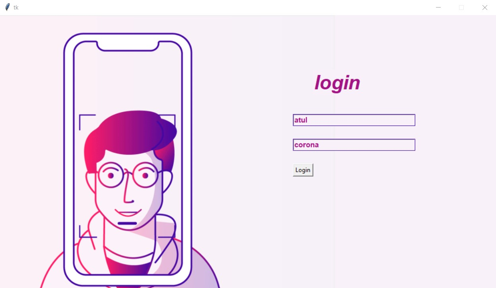
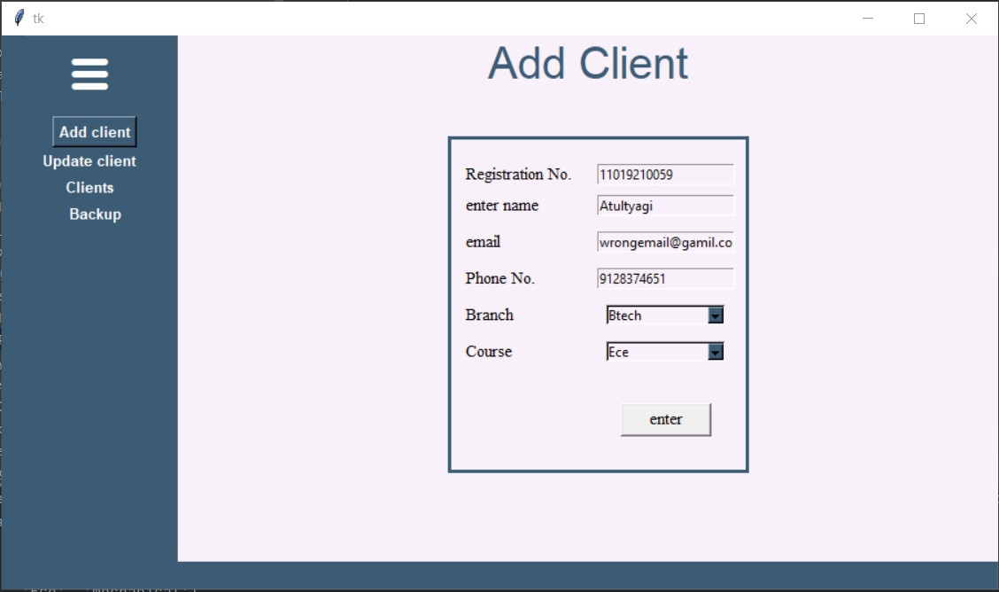
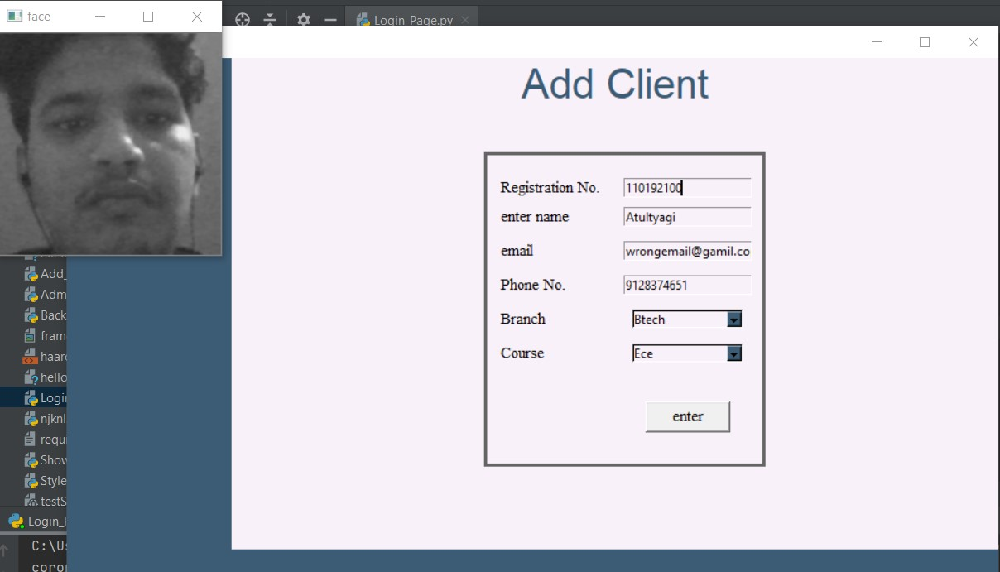
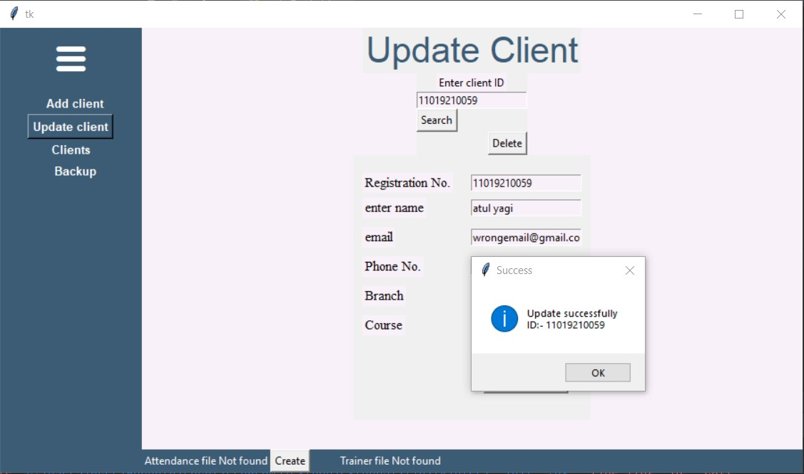
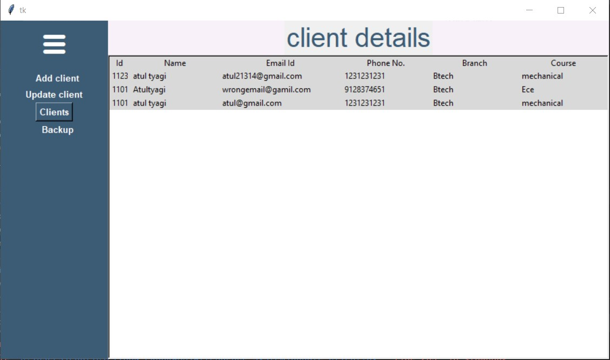
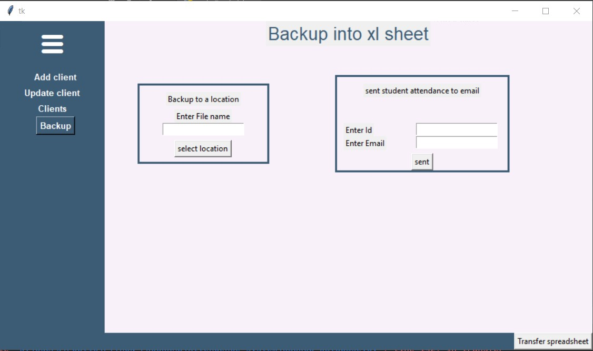
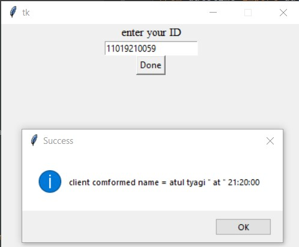
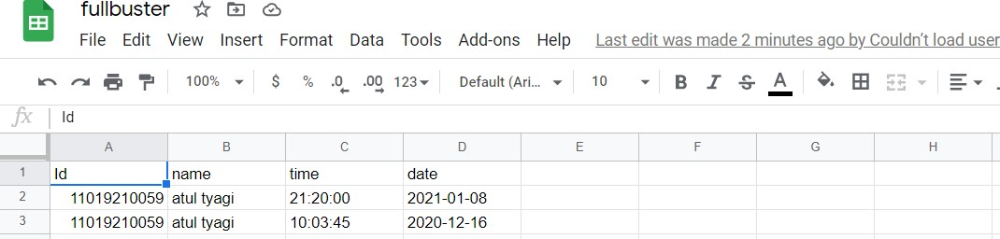

# facial-recognition-Attendance-System
A Facial recognition Attendance system using opencv

This repository contains code for facial-recognition-Attendance-System using openCV and python with a tkinter gui interface. 

Technology used : -openCV (Opensource Computer Vision) -Python -tkinter GUI interface

# REQUIREMENT 

```
Opencv(cv2)
PIL
numpy
tkinter
sqlite3
time
datetime
os
os.path
re
email
glob
openpyxl
gspread
xlsxwriter
oauth2client
```


**You can refer this file  for modules version**
```requirements.txt```

**You can  refer google for their working , installation  and other knowledge**

# DEMO

# Admin Side 
Firstyou need to run the  [Login_Page.py](Login_Page.py)




After filling the **user name** =>  ```atul``` **Password** => ```corona``` 

You came to the main page of this project at this page there is many options 

**1 ADD client 

In this option you may have to fill the clent/student details ('there is many conditions at the back end so if any error came please read carefully the error may be of some databse error  so due to that you may need to cahnge some values ')







**2 Update client**

In this option you can simply update the previous client/student data just by entering their ID . And you can also create a local Attendance file *IF IT IS NOT PRESENT And also check that the client/student Trainer file (File is which th facial data is present) is present or not if not you can also create.





**3 Clients**

In this option you just simply see the imformations of client/students





**4 BACKUP**

By the help of Backup option you can backup attendance file to a location and Also **email the attendance of a particular cleint to a email address** For this you just need to 
provide you email id and password in ```Backup_Database.py``` file by this email our program sent emails to the cleints/students , and also enable  [Less Secure apps](https://myaccount.google.com/lesssecureapps?pli=1&rapt=AEjHL4O60nbAZyuojxGT8ChwsTYs7rNyxh7NVUSxbq3ty6TyihvrsctF2ticq7qESTyYSxXe-T-e8ZO1B_clxbnl3cHiYHM1sQ) for your that email id. 
and the daily attendance also stored in the google drive spreedsheets for this you need to get api on  [google sheet api](https://developers.google.com/sheets/api/quickstart/python) . You get the ```.json``` file past this file in the main directory of program and renamed it ```testSheets-9c1b98942881.json``` 




## User Side 

At this you just need to enter your ID after that it Recognise your face if it matches it mark your Attendance on database and also on google spreadsheet . 







